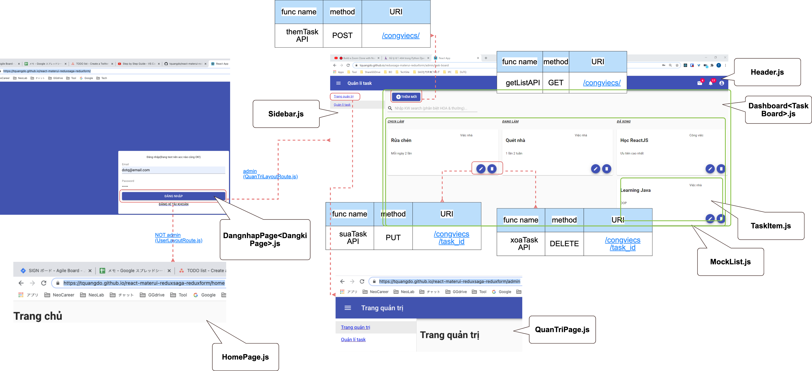
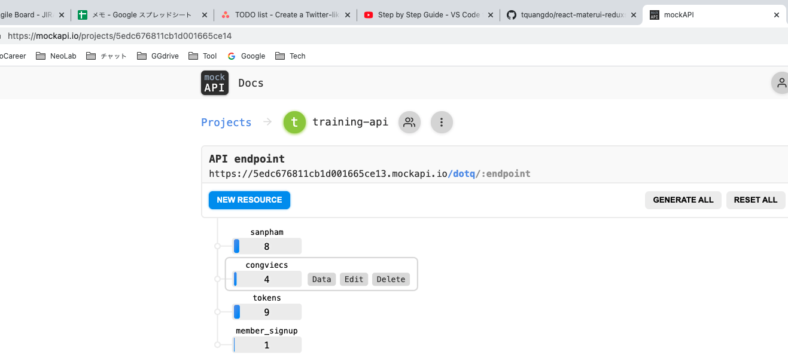
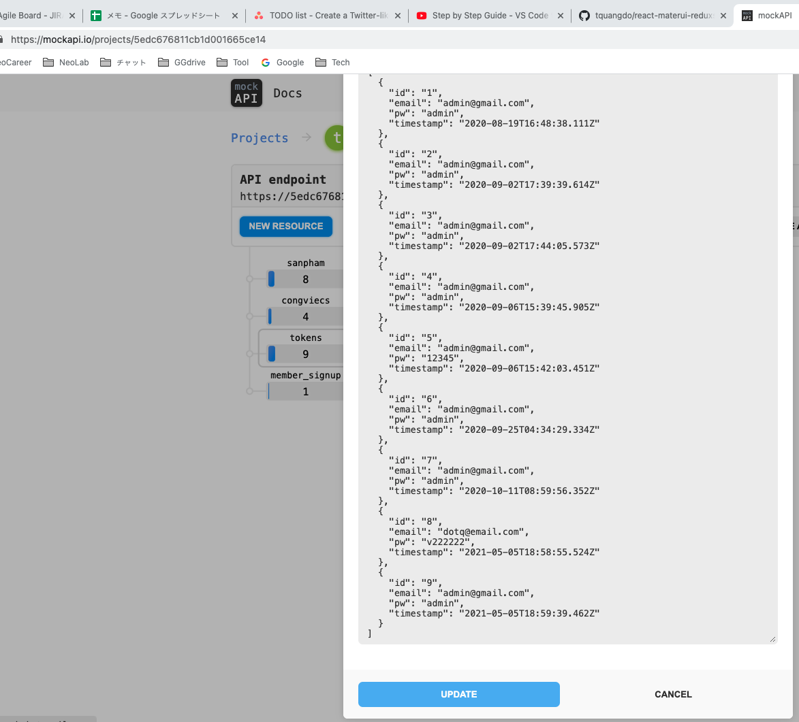

# react-materui-reduxsaga-reduxform 🐳




## API

### URI
- `https://5edc676811cb1d001665ce13.mockapi.io/dotq/`

1. `congviecs`
2. `tokens`: data of login users (same with `member_signup`)
=> still NOT done login process yet, all login accs will be inserted into here

3. `member_signup`

## Note

- how to know login acc is admin or not? => hardcode now!
```js
src/sagas/AuthSaga.js
if (
    email === 'admin@gmail.com' && pw === 'admin'
) {...}
```
